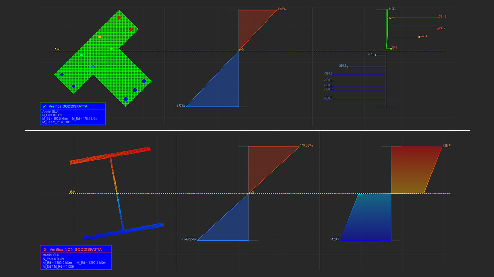
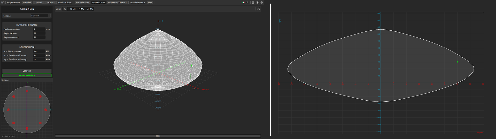
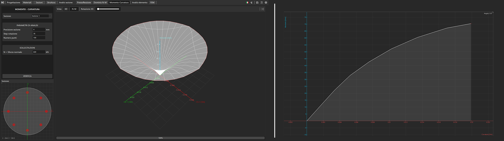

# SectionCheck

  

Un software leggero e intuitivo sviluppato a scopo didattico per l'analisi strutturale di elementi strutturali. Progettato per gestire geometrie complesse e comportamenti non lineari con un'interfaccia utente semplificata.

---

## Progettazione

- **Materiali:** Definizione dei materiali tramite legami costitutivi non lineari.
- **Sezioni:** Disegno di sezioni di qualunque forma, con barre longitudinali e staffe.
- **Struttura:** Definizione del telaio generale della struttura.

---

## Analisi Sezione

### Pressoflessione
Calcolo della pressoflessione centrata e deviata.

  

### Dominio di Interazione
Calcolo e visualizzazione dei domini di interazione tridimensionali M-N (Momento-Sforzo Normale).

  

### Diagramma Momento-Curvatura
Calcolo e visualizzazione dei diagrammi momento-curvatura tridimensionali (360°).

  

---

## Analisi Elemento

- **FEM:** Solver agli elementi finiti con comportamento non lineare dei materiali.

---

## ✨ UI Semplice
Interfaccia essenziale pensata per un utilizzo immediato senza configurazioni complesse.